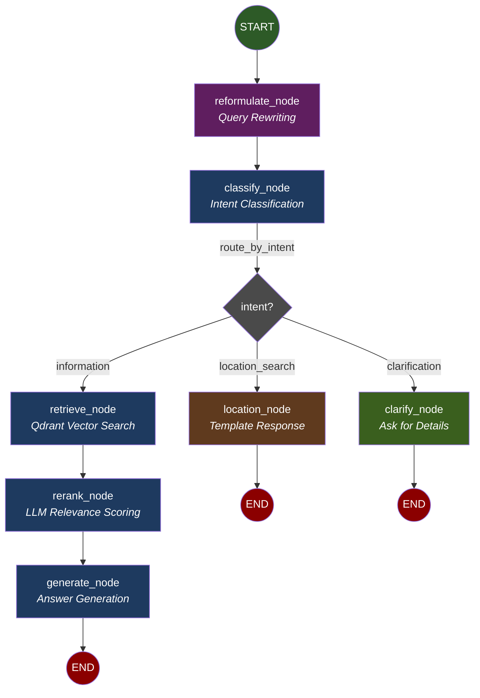
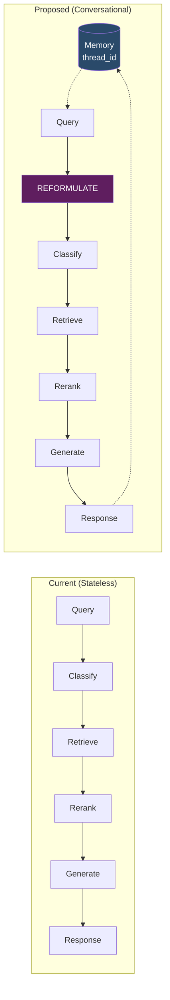
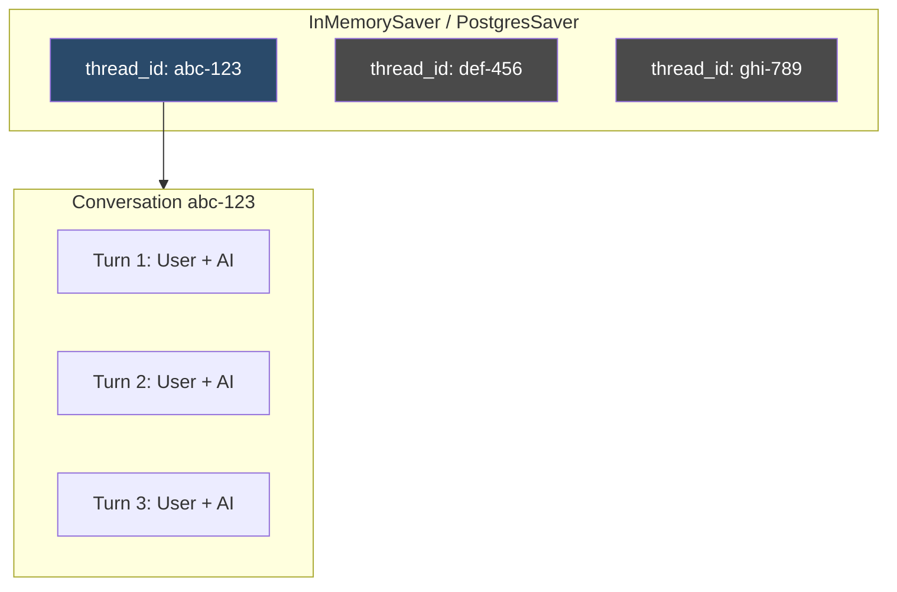
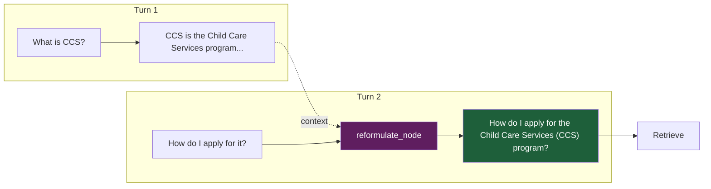

# LangGraph Conversational RAG Pipeline

Mermaid diagram showing the proposed conversational graph flow with multi-turn memory.

## Graph Diagram



## Comparison: Stateless vs Conversational



## Graph Structure

| Path | Flow | Use Case |
|------|------|----------|
| **Information** | `START → reformulate → classify → retrieve → rerank → generate → END` | Policy questions, eligibility queries |
| **Location** | `START → reformulate → classify → location → END` | "Find childcare near me" |
| **Clarification** | `START → reformulate → classify → clarify → END` | Ambiguous requests needing more info |

## Nodes

| Node | File | Description |
|------|------|-------------|
| `reformulate` | `chatbot/graph/nodes/reformulate.py` | **NEW** - Rewrites context-dependent queries to standalone |
| `classify` | `chatbot/graph/nodes/classify.py` | LLM intent classification (information, location_search, clarification) |
| `retrieve` | `chatbot/graph/nodes/retrieve.py` | Qdrant hybrid/dense vector search using `reformulated_query` |
| `rerank` | `chatbot/graph/nodes/rerank.py` | LLM-based relevance scoring with conversation context |
| `generate` | `chatbot/graph/nodes/generate.py` | Answer generation with citations |
| `location` | `chatbot/graph/nodes/location.py` | Template response with HHS facility search link |
| `clarify` | `chatbot/graph/nodes/clarify.py` | **NEW** - Asks user for missing information |

## State (ConversationalRAGState)

Defined in `chatbot/graph/state.py`:

```python
from typing import TypedDict, Literal, Annotated
from langgraph.graph.message import add_messages
from langchain_core.messages import BaseMessage

class ConversationalRAGState(TypedDict):
    # Conversation history (accumulated via add_messages reducer)
    messages: Annotated[list[BaseMessage], add_messages]
    
    # Current turn
    query: str                              # Original user query
    reformulated_query: str | None          # History-aware standalone query
    
    # Routing
    intent: Literal["information", "location_search", "clarification"] | None
    needs_clarification: bool
    
    # Retrieval (information path)
    retrieved_chunks: list[dict]            # From Qdrant
    reranked_chunks: list[dict]             # After LLM scoring
    
    # Output
    answer: str | None
    sources: list[dict]
    response_type: str
    action_items: list[dict]
    
    # Debug
    debug: bool
    debug_info: dict | None
```

## Memory Architecture



## Query Reformulation Flow



## Conditional Routing

Defined in `chatbot/graph/edges.py`:

```python
def route_by_intent(state: ConversationalRAGState) -> str:
    """Route based on classified intent."""
    intent = state.get("intent")
    
    if state.get("needs_clarification"):
        return "clarify"
    elif intent == "location_search":
        return "location"
    else:
        return "retrieve"
```

## Key Files

| File | Purpose |
|------|---------|
| `chatbot/graph/builder.py` | Graph construction with checkpointer |
| `chatbot/graph/state.py` | `ConversationalRAGState` TypedDict |
| `chatbot/graph/edges.py` | Conditional routing logic |
| `chatbot/graph/nodes/reformulate.py` | **NEW** - Query reformulation |
| `chatbot/graph/nodes/clarify.py` | **NEW** - Clarification requests |
| `chatbot/memory.py` | **NEW** - Memory manager |

## Usage

```python
from chatbot import TexasChildcareChatbot

bot = TexasChildcareChatbot()

# Turn 1
r1 = bot.ask("What is the income limit for CCS?", thread_id="conv-123")

# Turn 2 - uses context from Turn 1
r2 = bot.ask("What about for a family of 4?", thread_id="conv-123")
# reformulated_query: "What is the income limit for CCS for a family of 4?"

# Turn 3 - continues context
r3 = bot.ask("How do I apply?", thread_id="conv-123")
# reformulated_query: "How do I apply for CCS?"

# New conversation
r4 = bot.ask("Where can I find daycare?", thread_id="conv-456")
```
