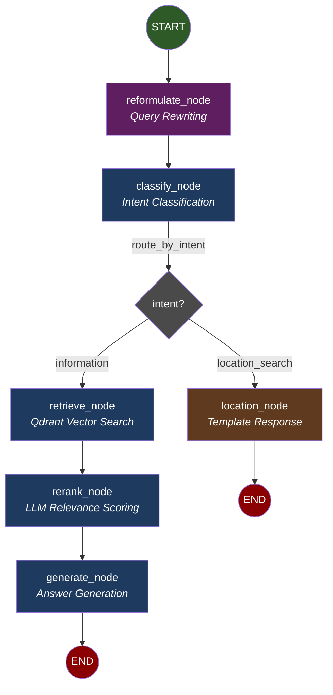
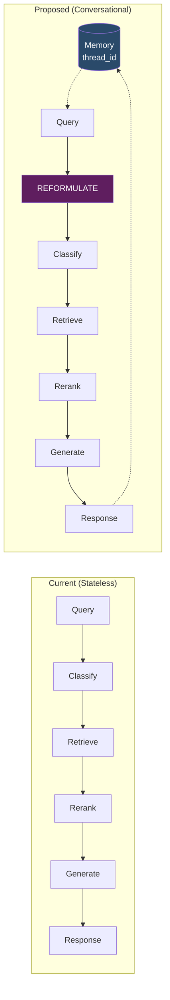
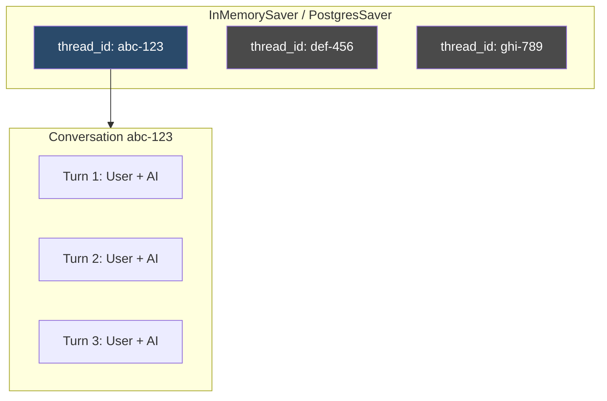
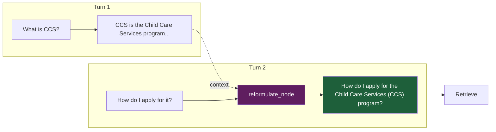
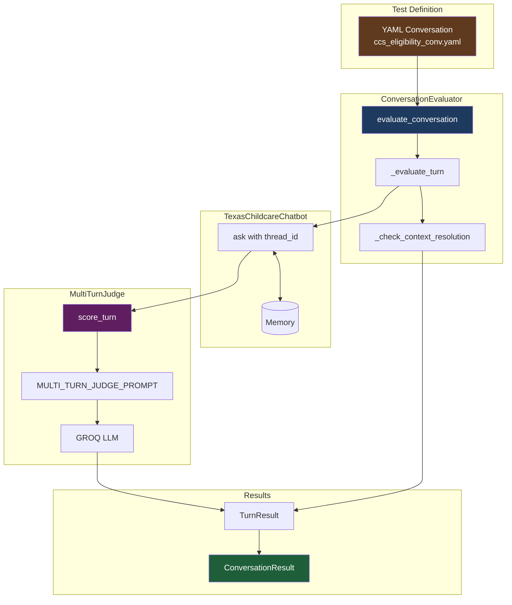
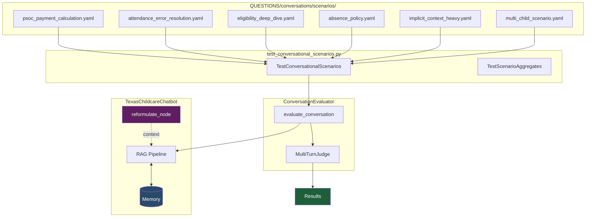

# LangGraph Conversational RAG Pipeline

Mermaid diagram showing the proposed conversational graph flow with multi-turn memory.

## Graph Diagram



## Comparison: Stateless vs Conversational



## Graph Structure

| Path | Flow | Use Case |
|------|------|----------|
| **Information** | `START → reformulate → classify → retrieve → rerank → generate → END` | Policy questions, eligibility queries |
| **Location** | `START → reformulate → classify → location → END` | "Find childcare near me" |

## Nodes

| Node | File | Description |
|------|------|-------------|
| `reformulate` | `chatbot/graph/nodes/reformulate.py` | Rewrites context-dependent queries to standalone |
| `classify` | `chatbot/graph/nodes/classify.py` | LLM intent classification (information, location_search) |
| `retrieve` | `chatbot/graph/nodes/retrieve.py` | Qdrant hybrid/dense vector search using `reformulated_query` |
| `rerank` | `chatbot/graph/nodes/rerank.py` | LLM-based relevance scoring with conversation context |
| `generate` | `chatbot/graph/nodes/generate.py` | Answer generation with citations |
| `location` | `chatbot/graph/nodes/location.py` | Template response with HHS facility search link |

## State (ConversationalRAGState)

Defined in `chatbot/graph/state.py`:

```python
from typing import TypedDict, Literal, Annotated
from langgraph.graph.message import add_messages
from langchain_core.messages import BaseMessage

class ConversationalRAGState(TypedDict):
    # Conversation history (accumulated via add_messages reducer)
    messages: Annotated[list[BaseMessage], add_messages]

    # Current turn
    query: str                              # Original user query
    reformulated_query: str | None          # History-aware standalone query

    # Routing
    intent: Literal["information", "location_search"] | None

    # Retrieval (information path)
    retrieved_chunks: list[dict]            # From Qdrant
    reranked_chunks: list[dict]             # After LLM scoring

    # Output
    answer: str | None
    sources: list[dict]
    response_type: str
    action_items: list[dict]

    # Debug
    debug: bool
    debug_info: dict | None
```

## Memory Architecture



## Query Reformulation Flow



## Conditional Routing

Defined in `chatbot/graph/edges.py`:

```python
def route_by_intent(state: ConversationalRAGState) -> str:
    """Route based on classified intent."""
    intent = state.get("intent")

    if intent == "location_search":
        return "location"
    else:
        return "retrieve"
```

## Key Files

| File | Purpose |
|------|---------|
| `chatbot/graph/builder.py` | Graph construction with checkpointer |
| `chatbot/graph/state.py` | `ConversationalRAGState` TypedDict |
| `chatbot/graph/edges.py` | Conditional routing logic |
| `chatbot/graph/nodes/reformulate.py` | Query reformulation |
| `chatbot/memory.py` | Memory manager |

## Usage

```python
from chatbot import TexasChildcareChatbot

bot = TexasChildcareChatbot()

# Turn 1
r1 = bot.ask("What is the income limit for CCS?", thread_id="conv-123")

# Turn 2 - uses context from Turn 1
r2 = bot.ask("What about for a family of 4?", thread_id="conv-123")
# reformulated_query: "What is the income limit for CCS for a family of 4?"

# Turn 3 - continues context
r3 = bot.ask("How do I apply?", thread_id="conv-123")
# reformulated_query: "How do I apply for CCS?"

# New conversation
r4 = bot.ask("Where can I find daycare?", thread_id="conv-456")
```

---

## Milestone 3: Testing Framework

Automated testing for multi-turn conversations.

### Architecture



### YAML Conversation Format

```yaml
# QUESTIONS/conversations/ccs_eligibility_conv.yaml
name: "CCS Eligibility Multi-Turn"
description: "Tests income eligibility flow with follow-ups"
domain: "eligibility"

conversation:
  - turn: 1
    user: "What are the income limits for childcare assistance?"
    expected_topics: ["SMI", "income eligibility"]
    min_score: 70

  - turn: 2
    user: "What about for a family of 4?"
    requires_context: true                    # Must resolve "What about"
    expected_answer_contains: ["family of 4", "income"]
    min_score: 70

  - turn: 3
    user: "How do I apply?"
    requires_context: true                    # Should know we're discussing CCS
    expected_answer_contains: ["apply", "workforce"]
    min_score: 70

success_criteria:
  min_average_score: 75
  all_turns_pass: true
  context_resolution_rate: 0.95
```

### Scoring System

| Criterion | Weight | Range | Description |
|-----------|--------|-------|-------------|
| Accuracy | 45% | 1-5 | Factual correctness |
| Completeness | 30% | 1-5 | Coverage of expected answer |
| Context Resolution | 15% | 0-1 | Proper expansion of references |
| Coherence | 10% | 1-3 | Clarity and structure |

**Composite Score Formula:**
```python
composite = (accuracy/5 * 45) + (completeness/5 * 30) + (context * 15) + (coherence/3 * 10)
# Range: 0-100
```

### Test Conversations

| File | Turns | Purpose |
|------|-------|---------|
| `ccs_eligibility_conv.yaml` | 4 | Income eligibility flow with follow-ups |
| `pronoun_resolution_conv.yaml` | 3 | Pronoun resolution ("it" → CCS) |
| `topic_switch_conv.yaml` | 3 | Topic changes mid-conversation |

### Usage

```bash
# Run single conversation
python -m evaluation.run_conversation_eval --conversation ccs_eligibility_conv.yaml --debug

# Run all conversations
python -m evaluation.run_conversation_eval --all

# With specific mode
python -m evaluation.run_conversation_eval --mode hybrid --all
```

### Output Example

```
============================================================
Evaluating: ccs_eligibility_conv.yaml
============================================================
  Turn 1: PASS (75.2)
  Turn 2: PASS (72.1)
    Original: What about for a family of 4?
    Reformulated: What are the income limits for a family of 4 for CCS?
  Turn 3: PASS (71.5)
  Turn 4: PASS (78.3)

  Conversation: PASS
  Average Score: 74.3
  Context Resolution: 100.0%
  All Turns Passed: True

============================================================
SUMMARY
============================================================
Conversations: 1/1 passed
Average Score: 74.3
Context Resolution: 100.0%
```

### Key Files

| File | Purpose |
|------|---------|
| `evaluation/conversation_evaluator.py` | ConversationEvaluator, TurnResult, ConversationResult |
| `evaluation/multi_turn_judge.py` | MultiTurnJudge (LLM-as-a-Judge) |
| `evaluation/prompts/multi_turn_judge_prompt.py` | Judge scoring prompt |
| `evaluation/run_conversation_eval.py` | CLI runner |
| `tests/test_conversational_rag.py` | Gate tests (TestMilestone3) |

### Gate Tests

```bash
pytest tests/test_conversational_rag.py::TestMilestone3 -v
```

| Test | Description |
|------|-------------|
| `test_yaml_parsing` | YAML files parse correctly |
| `test_evaluator_runs` | Evaluator executes conversations |
| `test_context_metric_calculated` | Context resolution rate computed |
| `test_judge_scores_turn` | Judge returns valid scores |

---

## Implementation Status

| Milestone | Status | Description |
|-----------|--------|-------------|
| **1. Memory** | ✅ Complete | Thread-scoped conversation memory with isolation |
| **2. Reformulation** | ✅ Complete | Context-aware query rewriting |
| **3. Testing Framework** | ✅ Complete | YAML-based conversation evaluation |
| **4. E2E Integration** | ✅ Complete | Graph architecture, scenario tests passing |

---

## Scenario Testing Suite

Comprehensive scenario tests validate conversational RAG across domains.

### Test Architecture



### Scenario Coverage

| Scenario | Domain | Turns | Tests |
|----------|--------|-------|-------|
| PSoC Payment Calculation | payment | 5 | Numeric reasoning, entity tracking |
| Attendance Error Resolution | attendance | 4 | Troubleshooting flow |
| Eligibility Deep Dive | eligibility | 4 | Multi-step determination |
| Absence Policy | policy | 4 | Policy understanding |
| Implicit Context Heavy | eligibility | 4 | Pronoun/reference stress test |
| Multi-Child Scenario | eligibility | 4 | Accumulating family context |

### Running Tests

```bash
# Run all scenario tests
pytest tests/test_conversational_scenarios.py -v

# Run with debug output
pytest tests/test_conversational_scenarios.py -v -s

# Direct execution with formatted output
python tests/test_conversational_scenarios.py
```

### Results Summary

- **6/6 scenarios passing**
- **Average score: 61.8**
- **Query reformulation working excellently**

Example reformulation:
```
Turn 1: "What is the income limit for CCS for a family of 3?"
Turn 2: "What about for 5?"
  → Reformulated: "What is the income limit for CCS for a family of 5?"
```

---

## Future Enhancements

| Phase | Status | Description |
|-------|--------|-------------|
| **5. Advanced Prompts** | Planned | Enhanced prompt templates |
| **6. Context Summarization** | Planned | Long conversation compression |
| **7. Production Ready** | Planned | PostgreSQL checkpointer, monitoring |
| **8. Clarification Flow** | Planned | Ambiguous request handling |
