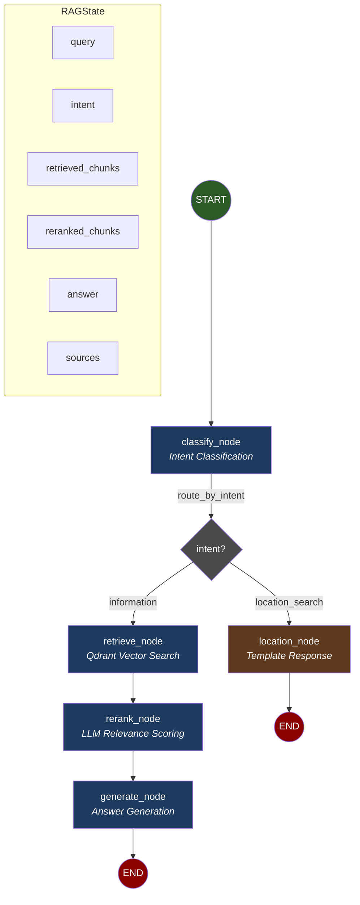

# LangGraph RAG Pipeline

Mermaid diagram showing the current graph flow for the Texas Childcare Chatbot.

## Graph Diagram



## Graph Structure

| Path | Flow | Use Case |
|------|------|----------|
| **Information** | `START → classify → retrieve → rerank → generate → END` | Policy questions, eligibility queries |
| **Location** | `START → classify → location → END` | "Find childcare near me" |

## Nodes

| Node | File | Description |
|------|------|-------------|
| `classify` | `chatbot/graph/nodes/classify.py` | LLM intent classification (information vs location_search) |
| `retrieve` | `chatbot/graph/nodes/retrieve.py` | Qdrant hybrid/dense vector search |
| `rerank` | `chatbot/graph/nodes/rerank.py` | LLM-based relevance scoring |
| `generate` | `chatbot/graph/nodes/generate.py` | Answer generation with citations |
| `location` | `chatbot/graph/nodes/location.py` | Template response with HHS facility search link |

## State (RAGState)

Defined in `chatbot/graph/state.py`:

```python
class RAGState(TypedDict):
    # Input
    query: str                              # User's question
    debug: bool                             # Enable debug output

    # Routing
    intent: Literal["information", "location_search"] | None

    # Retrieval (information path)
    retrieved_chunks: list[dict]            # From Qdrant
    reranked_chunks: list[dict]             # After LLM scoring

    # Output
    answer: str | None
    sources: list[dict]
    response_type: str
    action_items: list[dict]
    debug_info: dict | None
```

## Conditional Routing

Defined in `chatbot/graph/edges.py`:

- `route_by_intent(state)` returns `"retrieve"` or `"location"` based on `state["intent"]`

## Key Files

| File | Purpose |
|------|---------|
| `chatbot/graph/builder.py` | Graph construction with `StateGraph` |
| `chatbot/graph/state.py` | `RAGState` TypedDict definition |
| `chatbot/graph/edges.py` | Conditional routing logic |
| `chatbot/graph/nodes/*.py` | Individual node implementations |
