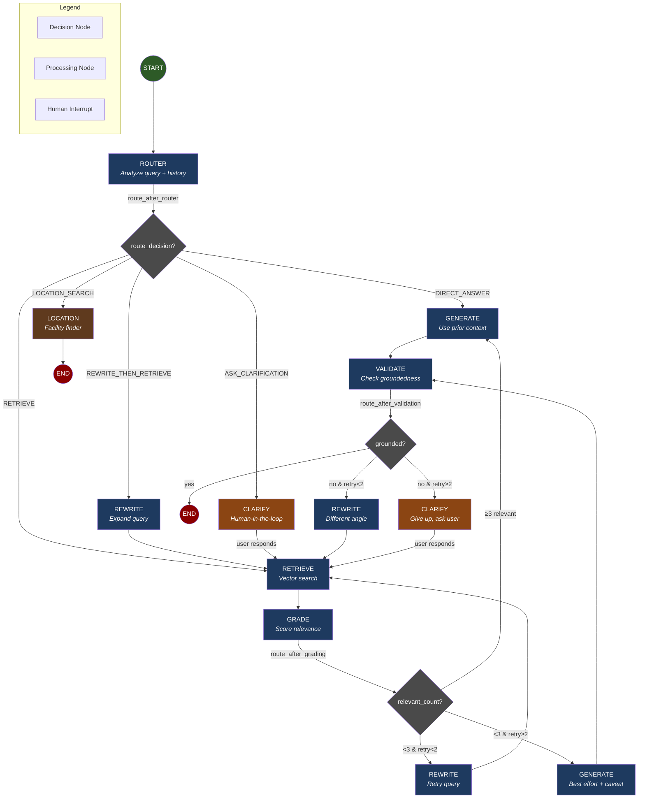
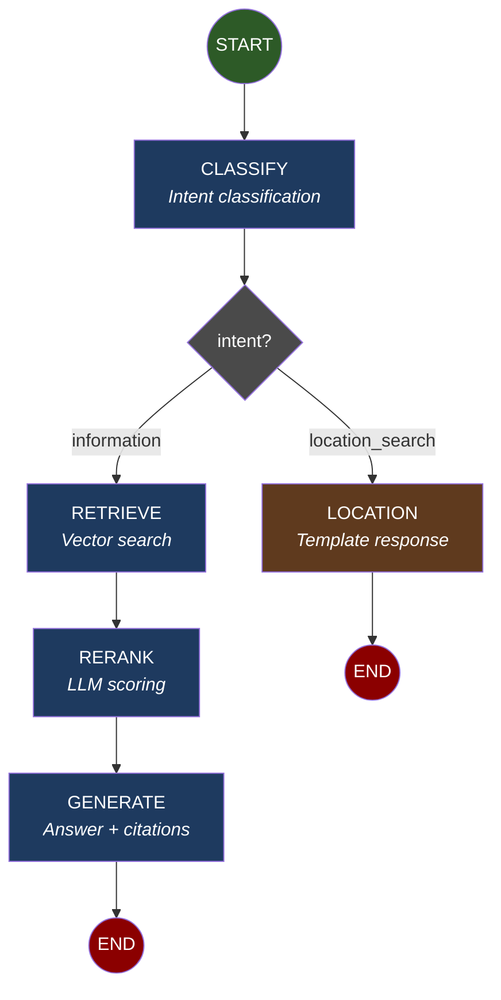

# Agentic RAG Graph Design

Mermaid diagram for the proposed conversational chatbot with agentic capabilities.

## Full Agentic Graph (Conversational Mode)



## Simple Mode Graph (Stateless - Current Behavior)



## Mode Comparison

| Aspect | Simple Mode (Stateless) | Agentic Mode (Conversational) |
|--------|------------------------|------------------------------|
| **Memory** | None | Checkpointer (thread_id) |
| **Query Handling** | As-is | Rewrite ambiguous queries |
| **Retrieval** | Always retrieve | Skip if prior context sufficient |
| **Quality Control** | Single pass | Grade → Retry → Validate |
| **Failure Handling** | Best effort | Clarification loop |
| **Config Flag** | `CONVERSATIONAL_MODE=false` | `CONVERSATIONAL_MODE=true` |

## Router Decisions

| Decision | Condition | Next Node |
|----------|-----------|-----------|
| `DIRECT_ANSWER` | Follow-up answerable from prior context | generate |
| `RETRIEVE` | New topic or factual question | retrieve |
| `REWRITE_THEN_RETRIEVE` | Ambiguous query, uses pronouns | rewrite |
| `ASK_CLARIFICATION` | Genuinely unclear | clarify |
| `LOCATION_SEARCH` | Facility finding request | location |

## State Definition (AgentState)

```python
class AgentState(TypedDict):
    # Conversation
    messages: list[BaseMessage]           # Full history

    # Current turn
    original_query: str
    rewritten_query: str | None

    # Retrieval
    retrieved_docs: list[Document]
    doc_relevance_scores: list[float]

    # Generation
    draft_answer: str | None
    final_answer: str | None
    sources: list[dict]

    # Control flow
    route_decision: str
    retry_count: int
    needs_clarification: str | None
    confidence: float
```

## Implementation Phases

| Phase | Component | Status |
|-------|-----------|--------|
| 0 | Migrate to LangGraph (stateless) | ✅ Done |
| 1 | Add checkpointer (memory) | Planned |
| 2 | Add query rewriter | Planned |
| 3 | Add router | Planned |
| 4 | Add document grader | Planned |
| 5 | Add validator | Planned |
| 6 | Add clarification (HITL) | Planned |

## Key Files

| File | Purpose |
|------|---------|
| `chatbot/graph/builder.py` | Graph construction |
| `chatbot/graph/state.py` | State definition |
| `chatbot/graph/edges.py` | Conditional routing |
| `chatbot/graph/nodes/*.py` | Node implementations |
| `chatbot/prompts/agentic/*.py` | New prompts (planned) |
