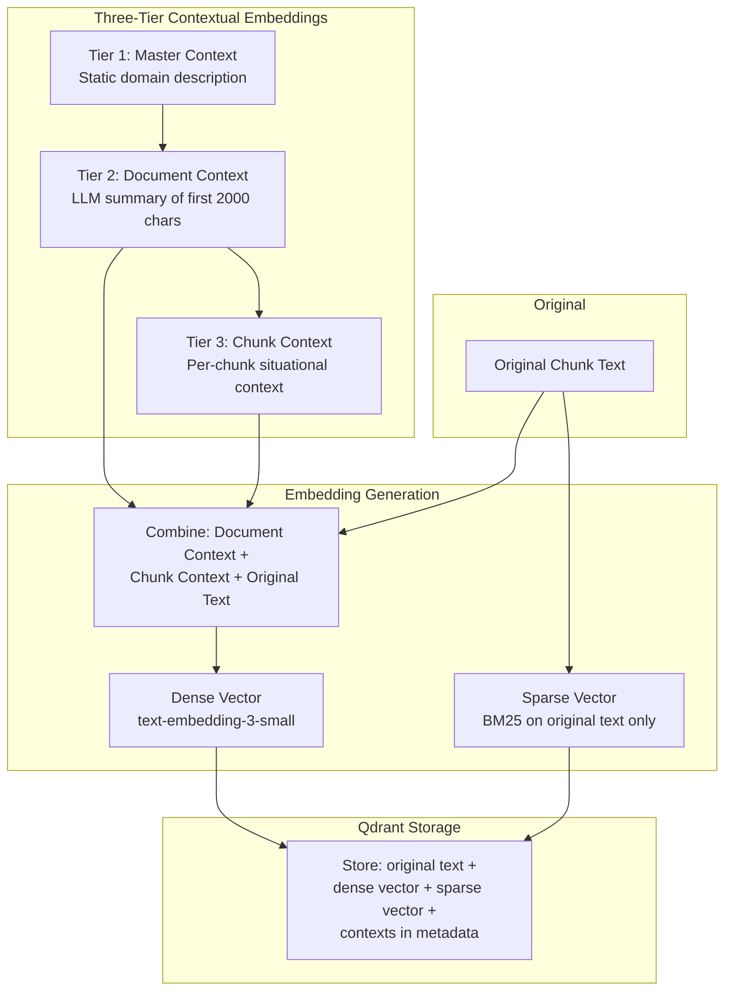

# Contextual Embeddings

```mermaid
flowchart TB
    subgraph Context["Three-Tier Contextual Embeddings"]
        MASTER[Tier 1: Master Context<br/>Static domain description]
        DOC[Tier 2: Document Context<br/>LLM summary of first 2000 chars]
        CHUNK_CTX[Tier 3: Chunk Context<br/>Per-chunk situational context]
    end

    subgraph Original
        TEXT[Original Chunk Text]
    end

    subgraph Embedding["Embedding Generation"]
        COMBINE[Combine: Document Context +<br/>Chunk Context + Original Text]
        DENSE[Dense Vector<br/>text-embedding-3-small]
        SPARSE[Sparse Vector<br/>BM25 on original text only]
    end

    MASTER --> DOC
    DOC --> CHUNK_CTX
    DOC --> COMBINE
    CHUNK_CTX --> COMBINE
    TEXT --> COMBINE
    COMBINE --> DENSE
    TEXT --> SPARSE

    subgraph Qdrant["Qdrant Storage"]
        STORE[Store: original text +<br/>dense vector + sparse vector +<br/>contexts in metadata]
    end

    DENSE --> STORE
    SPARSE --> STORE
```
