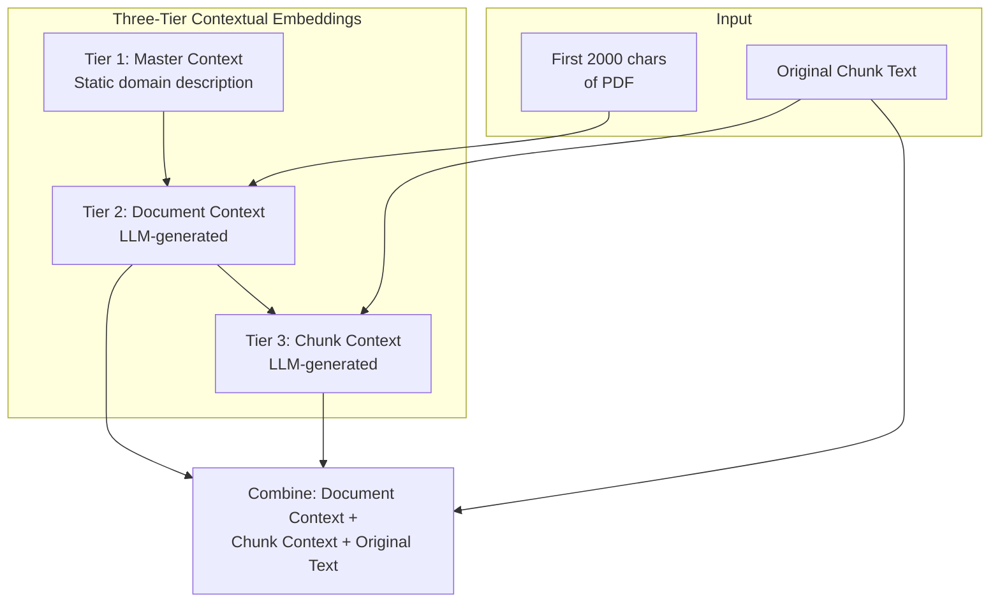

# Contextual Embeddings

## Example

**Tier 1: Master Context (Static)**
> This is official Texas Workforce Commission (TWC) documentation regarding childcare assistance programs. The content covers program eligibility requirements, income limits, payment procedures, provider regulations, and administrative guidelines for childcare services in Texas. The primary programs discussed are the Child Care Development Fund (CCDF) and Provider Services Operational Consultation (PSOC).

**Tier 2: Document Context (Per-PDF)**
> This document is "bcy-26-income-eligibility-and-maximum-psoc-twc.pdf" (5 pages). It contains income eligibility tables for the Child Care Services program, showing maximum income thresholds by family size for initial eligibility (85% SMI) and continued eligibility (85% SMI).

**Tier 3: Chunk Context (Per-Chunk)**
> This chunk contains an income eligibility table showing annual income limits. Family size 4 has initial eligibility at $62,677 and continued eligibility at $62,677. The data is from the 85% State Median Income (SMI) threshold.

**Original Chunk Text**
> Family Size | Initial Eligibility | Continued Eligibility
> 4 | $62,677 | $62,677
> 5 | $73,172 | $73,172
