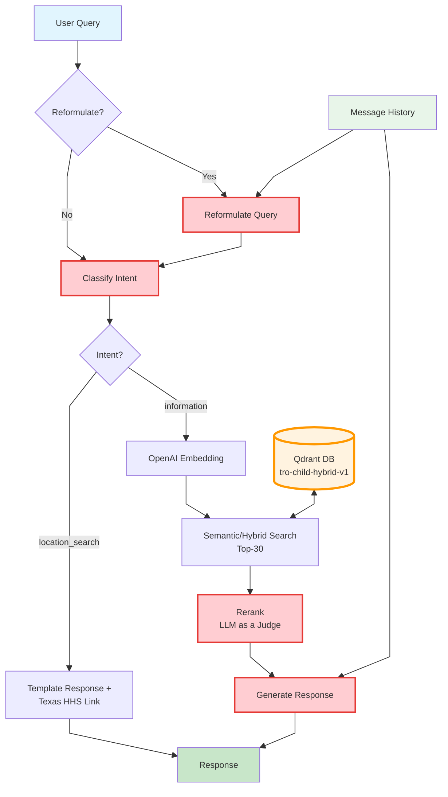

# Custom RAG Pipeline (Conversational)

```mermaid
%%{init: {'flowchart': {'nodeSpacing': 40, 'rankSpacing': 40, 'curve': 'linear'}, 'themeVariables': {'fontSize': '12px'}}}%%
flowchart TD
    A[User Query] --> B{Reformulate?}

    B -->|Yes| C[Reformulate Query]
    B -->|No| D[Classify Intent]
    C --> D

    D --> E{Intent?}

    E -->|location_search| F[Template Response +<br/>Texas HHS Link]
    F --> Z[Response]

    E -->|information| G[OpenAI Embedding]
    G --> H[Semantic/Hybrid Search<br/>Top-30]
    QDB[(Qdrant DB<br/>tro-child-hybrid-v1)] <--> H

    H --> I[Rerank<br/>LLM as a Judge]

    I --> J[Generate Response]
    MEM[Message History] --> C
    MEM --> J

    J --> Z

    style A fill:#e1f5fe
    style Z fill:#c8e6c9
    style QDB fill:#fff3e0,stroke:#ff9800,stroke-width:3px
    style MEM fill:#e8f5e9
    style C fill:#ffcdd2,stroke:#e53935,stroke-width:2px
    style D fill:#ffcdd2,stroke:#e53935,stroke-width:2px
    style I fill:#ffcdd2,stroke:#e53935,stroke-width:2px
    style J fill:#ffcdd2,stroke:#e53935,stroke-width:2px
```
