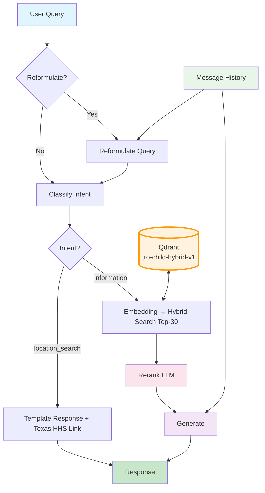

# Custom RAG Pipeline (Conversational)

```mermaid
flowchart TD
    A[User Query] --> B{Reformulate?}
    B -->|Yes| C[Reformulate Query]
    B -->|No| D
    C --> D[Classify Intent]

    D --> E{Intent?}
    E -->|location_search| F[Template Response + Texas HHS Link] --> Z[Response]

    E -->|information| G[Embedding → Hybrid Search Top-30]
    QDB[(Qdrant<br/>tro-child-hybrid-v1)] <--> G
    G --> I[Rerank LLM] --> J[Generate] --> Z

    MEM[Message History] --> C
    MEM --> J

    style A fill:#e1f5fe
    style Z fill:#c8e6c9
    style QDB fill:#fff3e0,stroke:#ff9800,stroke-width:3px
    style I fill:#fce4ec
    style J fill:#f3e5f5
    style MEM fill:#e8f5e9
```
