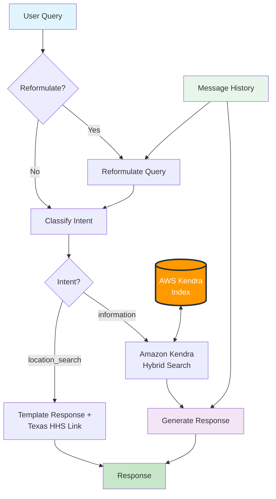

# Kendra Retrieval Mode

```mermaid
flowchart TD
    A[User Query] --> B{Reformulate?}

    B -->|Yes| C[Reformulate Query]
    B -->|No| D[Classify Intent]
    C --> D

    D --> E{Intent?}

    E -->|location_search| F[Template Response +<br/>Texas HHS Link]
    F --> Z[Response]

    E -->|information| G[Amazon Kendra<br/>Hybrid Search]
    AWS[(AWS Kendra<br/>Index)] <--> G

    G --> J[Generate Response]
    MEM[Message History] --> C
    MEM --> J

    J --> Z

    style A fill:#e1f5fe
    style Z fill:#c8e6c9
    style AWS fill:#ff9900,stroke:#232f3e,stroke-width:3px,color:#fff
    style J fill:#f3e5f5
    style MEM fill:#e8f5e9
```

**Note:** Kendra mode skips LLM reranking - Kendra has built-in semantic ranking.
