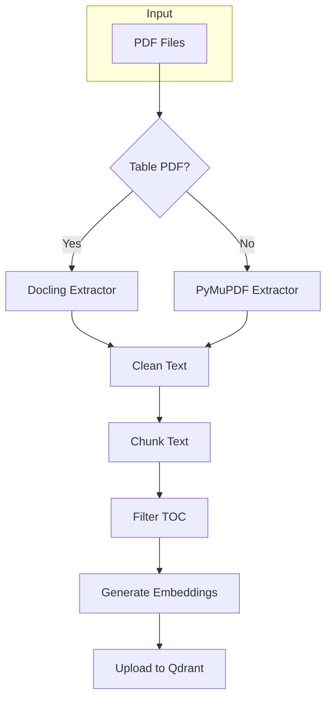

# Loading Pipeline

```mermaid
flowchart TB
    subgraph Input
        PDF[PDF Files]
    end

    PDF --> SELECT{Table PDF?}
    SELECT -->|Yes| DOCLING[Docling Extractor]
    SELECT -->|No| PYMUPDF[PyMuPDF Extractor]

    DOCLING --> CLEAN[Clean Text]
    PYMUPDF --> CLEAN

    CLEAN --> CHUNK[Chunk Text]
    CHUNK --> FILTER[Filter TOC]
    FILTER --> EMBED[Generate Embeddings]
    EMBED --> STORE[Upload to Qdrant]
```
