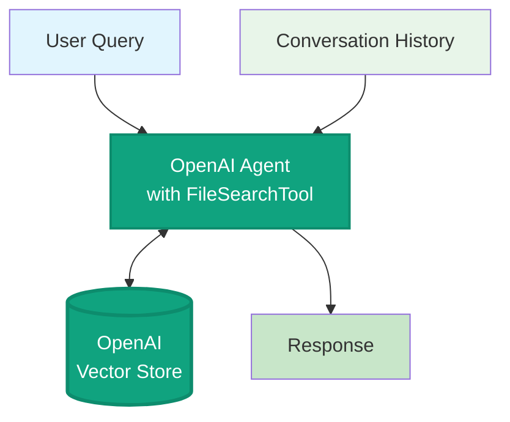

# OpenAI Agent Mode

**Note:** OpenAI Agent mode bypasses the LangGraph pipeline entirely. The OpenAI Agents SDK handles retrieval and generation in a single call using FileSearchTool with the OpenAI Vector Store.
