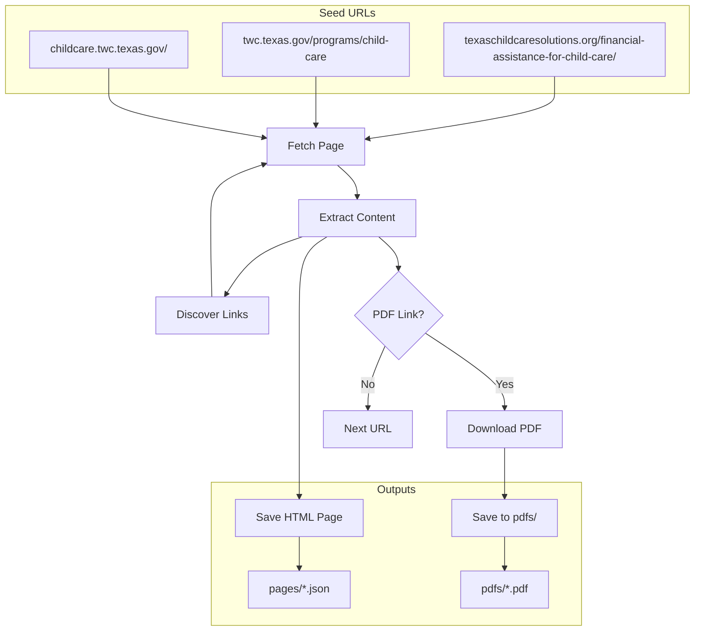

# Web Scraping Pipeline

```mermaid
flowchart TB
    subgraph Seeds["Seed URLs"]
        S1[texaschildcaresolutions.org/financial-assistance-for-child-care/]
        S2[twc.texas.gov/programs/child-care]
        S3[childcare.twc.texas.gov/]
    end

    S1 --> FETCH[Fetch Page]
    S2 --> FETCH
    S3 --> FETCH

    FETCH --> EXTRACT[Extract Content]
    EXTRACT --> LINKS[Discover Links]
    LINKS --> FETCH
    EXTRACT --> SAVE_HTML[Save HTML Page]
    EXTRACT --> PDF{PDF Link?}
    PDF -->|Yes| DOWNLOAD[Download PDF]
    PDF -->|No| NEXT[Next URL]
    DOWNLOAD --> SAVE_PDF[Save to pdfs/]

    subgraph Outputs
        SAVE_HTML --> O1[pages/*.json]
        SAVE_PDF --> O2[pdfs/*.pdf]
    end
```
