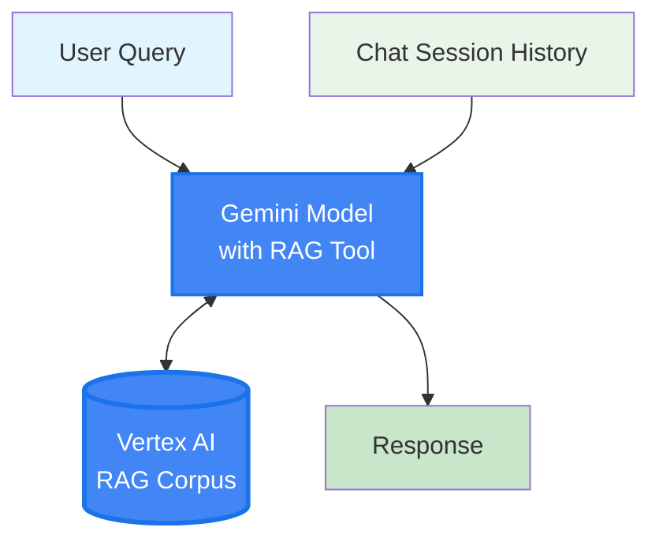

# Vertex AI Agent Mode

**Note:** Vertex AI Agent mode bypasses the LangGraph pipeline entirely. Gemini with the RAG retrieval tool handles retrieval and generation in a single call using the Vertex AI RAG Corpus.
