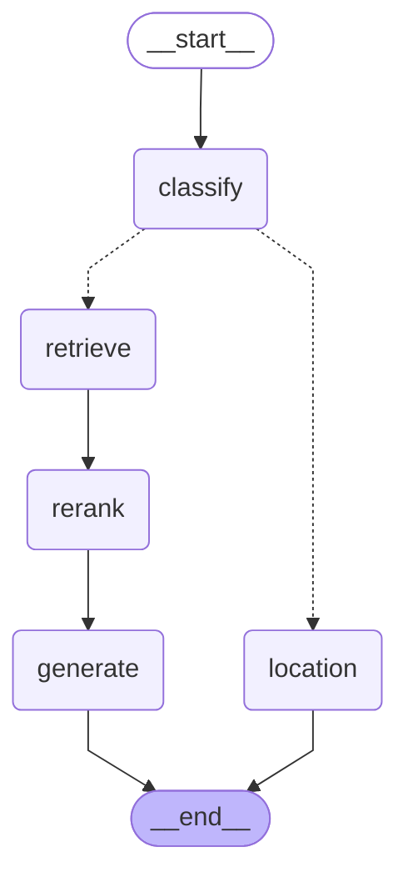

# RAG Pipeline Graph

```mermaid
---
config:
  flowchart:
    curve: linear
---
graph TD;
	__start__([<p>__start__</p>]):::first
	classify(classify)
	retrieve(retrieve)
	rerank(rerank)
	generate(generate)
	location(location)
	__end__([<p>__end__</p>]):::last
	__start__ --> classify;
	classify -.-> location;
	classify -.-> retrieve;
	rerank --> generate;
	retrieve --> rerank;
	generate --> __end__;
	location --> __end__;
	classDef default fill:#f2f0ff,line-height:1.2
	classDef first fill-opacity:0
	classDef last fill:#bfb6fc
```

## Paths

- **Information path**: `start → classify → retrieve → rerank → generate → end`
- **Location path**: `start → classify → location → end`
